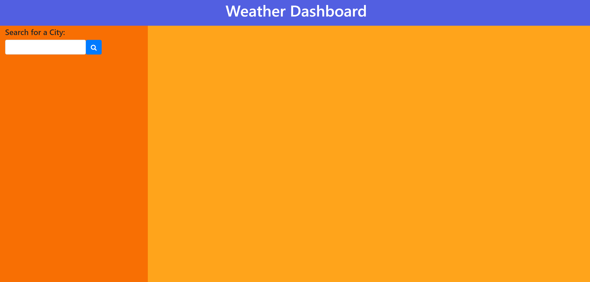

# GasiorowskiWeatherApp

## Description:
This porject is a travel weather application, the code was generated by myself with the assistance of the GWU coding Boot camp tutoring program. Using this will allow a user to input the name of any city world-wide and be shown the current temperature, windspeed, humidity, and what the type of weather is as well as they will be shown the same information for a five day forecast

## Installation:
This application requires no additional softeware or programs to be installed. Access to VS code or another code writing software is the only requirement to use this program.

## Usage: 
### The user will open the site and be greeted with this homescreen

### The user will then type in the name of any city and be shown the current weather and conditions,

### The user upon scrolling down will see the same information as listed above but for the next five day forecast,

### The user will have the ability to type any any city name and the previous city data will be cleared from the screen and new data will be uploaded,

MIT License

    
